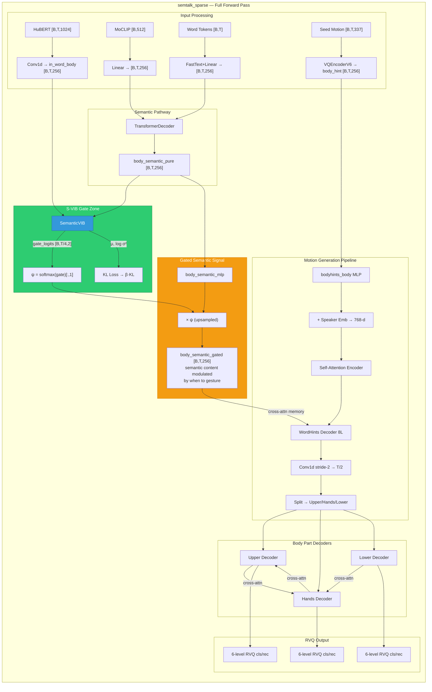

# SemTalk Codebase Overview

## What is SemTalk?

SemTalk is a **holistic co-speech motion generation** system that creates realistic full-body animations (including face, hands, upper body, and lower body) from speech audio. It was published at ICCV 2025.

The key innovation is **frame-level semantic emphasis**: beyond rhythmic audio-motion alignment, SemTalk emphasizes semantically important frames using MoCLIP (Motion-CLIP) embeddings for better gesture expressiveness.

## Architecture Overview

```
┌─────────────────────────────────────────────────────────────────────────┐
│                          SemTalk Pipeline                               │
├─────────────────────────────────────────────────────────────────────────┤
│                                                                         │
│  Audio (.wav) ──► HuBERT Features ──► ┌──────────────────────────────┐ │
│                                       │     Stage 1: Base Motion     │ │
│  Text (optional) ──► FastText ────────►  - Rhythmic alignment        │ │
│                                       │  - Body part cross-attention │ │
│  Seed Pose (4 frames) ────────────────►  - Output: q_b (base latent) │ │
│                                       └──────────────┬───────────────┘ │
│                                                      │                 │
│  MoCLIP Text Embeddings ──────────────► ┌────────────┴───────────────┐ │
│                                         │  Stage 2: Sparse Semantic  │ │
│                                         │  - Semantic emphasis        │ │
│                                         │  - Adaptive gating ψ       │ │
│                                         │  - Output: q_s (semantic)  │ │
│                                         └────────────┬───────────────┘ │
│                                                      │                 │
│                              q_m = MLP(ψ·q_s + (1−ψ)·q_b)             │
│                                                      │                 │
│                                         ┌────────────┴───────────────┐ │
│                                         │   RVQ-VAE Decoder          │ │
│                                         │   - Decode latents to      │ │
│                                         │     full body motion       │ │
│                                         │   - Output: 55 joint rot6d │ │
│                                         └────────────────────────────┘ │
└─────────────────────────────────────────────────────────────────────────┘
```

## Key Components

### 1. Data Pipeline (`dataloaders/`)

| File | Purpose |
|------|---------|
| `semtalk_dataloader.py` | Main dataloader for BEAT2 dataset |
| `save_train_dataset.py` | Preprocess training data to LMDB |
| `save_test_dataset.py` | Preprocess test data to pickle |
| `data_tools.py` | Data augmentation and preprocessing utilities |

**Data format:**
- Motion: 55 SMPLX joints in rot6d (330) + translation (3) + contact (4) = 337 dims
- Audio: Pre-extracted HuBERT features (1024d) + onset/amplitude (3d)
- Text: FastText word indices + MoCLIP chunk embeddings (256d)

### 2. Models (`models/`)

| Model | File | Description |
|-------|------|-------------|
| **semtalk_base** | `semtalk.py` | Stage 1: Rhythmic base motion generation (`semtalk_base` class) |
| **semtalk_sparse** | `semtalk.py` | Stage 2: Semantic sparse emphasis (`semtalk_sparse` class) |
| **GestureLSMBaseMotion** | `flow_matching_base.py` | Alternative: Flow matching base |
| **RVQ-VAE** | `quantizer.py` | Residual VQ for motion tokenization |

**Body parts:**
- `face`: Facial expressions (trained separately with face VAE)
- `upper`: Upper body joints
- `hands`: Left and right hand joints
- `lower`: Lower body and feet

### 3. Trainers

| Trainer | File | Purpose |
|---------|------|---------|
| `ae_trainer.py` | RVQ-VAE training for body parts |
| `aeface_trainer.py` | Face-specific VAE training |
| `semtalk_base_trainer.py` | Stage 1 training |
| `semtalk_sparse_trainer.py` | Stage 2 training |
| `flowmatch_base_trainer.py` | Flow matching alternative |

### 4. Configuration (`configs/`)

All hyperparameters are in YAML configs:

```yaml
# Key config fields:
trainer: semtalk_sparse      # Which trainer to use
model: semtalk_sparse        # Which model architecture
g_name: SemTalkSparse        # Model class name
batch_size: 128
pose_length: 64              # Frames per chunk (at 30fps = ~2s)
lr_base: 5e-5
epochs: 200
use_flow_matching: false     # Toggle Flow Matching base
mass_cond_mode: none         # Sparse-side weight-informed conditioning
base_mass_cond_mode: none    # Base/beat-side weight-informed conditioning
joint_train_base_in_sparse: false  # Train base jointly during sparse stage
```

### 4.1 Weight-Embedding Conditioning (Apr 2026 update)

- Sparse pathway conditioning:
    - `mass_cond_mode` + `mass_cond_scale`
    - Injected in `semtalk_sparse` on `body_semantic_pure` before S-VIB gating.
- Base/beat pathway conditioning:
    - `base_mass_cond_mode` + `base_mass_cond_scale`
    - Injected in `semtalk_base` on `in_audio_body` in both `forward()` and `forward_latent()`.
- Joint optimization toggle:
    - `joint_train_base_in_sparse: true` unfreezes base and adds base params to sparse optimizer.

### 5. Utilities (`utils/`)

| File | Purpose |
|------|---------|
| `run_fgd_eval.py` | FGD (Fréchet Gesture Distance) evaluation |
| `metric.py` | Various motion quality metrics |
| `config.py` | Config parsing and argument handling |
| `other_tools.py` | Miscellaneous utilities |

## Training Workflow

### Full Training Pipeline

```bash
# 1. Generate datasets (one-time)
python dataloaders/save_train_dataset.py
python dataloaders/save_test_dataset.py

# 2. Train RVQ-VAEs (or use pretrained)
python train.py --train_rvq --config configs/cnn_vqvae_face_30.yaml
python train.py --train_rvq --config configs/cnn_vqvae_upper_30.yaml
# ... (hands, lower, lower_foot)

# 3. Train Stage 1: Base Motion
python train.py --config configs/semtalk_base.yaml
# → Save best checkpoint, update base_ckpt in sparse config

# 4. Train Stage 2: Sparse Semantic
python train.py --config configs/semtalk_moclip_sparse.yaml

# 5. Evaluate
python train.py --test_state --config configs/semtalk_moclip_sparse.yaml
```

### Multi-GPU Training

```bash
# Using provided script (handles DDP setup)
./run_train_moclip_4gpu.sh

# Or manually with torchrun
torchrun --nproc_per_node=4 train_torchrun.py --config configs/semtalk_moclip_sparse.yaml
```

## Key Hyperparameters

| Parameter | Typical Value | Impact |
|-----------|---------------|--------|
| `batch_size` | 128 | Memory usage, training stability |
| `pose_length` | 64 | Temporal context (64 frames @ 30fps ≈ 2.1s) |
| `lr_base` | 5e-5 | Learning rate for base model |
| `lr_sparse` | 1e-4 | Learning rate for sparse model |
| `semantic_weight` | 1.0 | Weight for semantic (MoCLIP) loss |
| `rec_weight` | 1.0 | Weight for motion reconstruction loss |

## Output Format

Generated motions are saved as `.npz` files with SMPLX format:
- `body_pose`: [T, 63] - Body joint rotations
- `lhand_pose`: [T, 45] - Left hand joints
- `rhand_pose`: [T, 45] - Right hand joints
- `jaw_pose`: [T, 3] - Jaw rotation
- `expression`: [T, 50] - Face expression coefficients
- `transl`: [T, 3] - Root translation

Visualize with Blender + SMPLX addon (see README.md).

## Development Notes

### Adding New Features

1. **New conditioning signals**: Add to dataloader, modify model's forward signature
2. **New loss functions**: Add to `optimizers/loss_factory.py`
3. **New architectures**: Create new model file, register in config
4. **New training logic**: Create new trainer inheriting from `BaseTrainer`

### Debugging Tips

- Check `outputs/rank_logs/` for DDP errors
- Use `stat: ts` in config for TensorBoard (instead of WandB)
- Run with `batch_size: 4` and single GPU first
- Watch GPU memory with `nvidia-smi -l 1`

### Current Research Directions

From `models/DEVELOPMENT_LOG.md`:
- **MoCLIP conditioning**: Adding semantic awareness to base motion
- **Flow Matching**: Alternative generative model (GestureLSM-style)
- **Physiological constraints**: Physics-based motion regularization
- **DDP optimization**: Multi-GPU training stability

## File Dependencies Graph

```
train.py
├── config (from YAML)
├── dataloaders/{dataset}.py
├── models/{model}.py
├── {trainer}.py
│   ├── BaseTrainer (train.py)
│   ├── Model
│   └── Loss functions
└── utils/*
```
